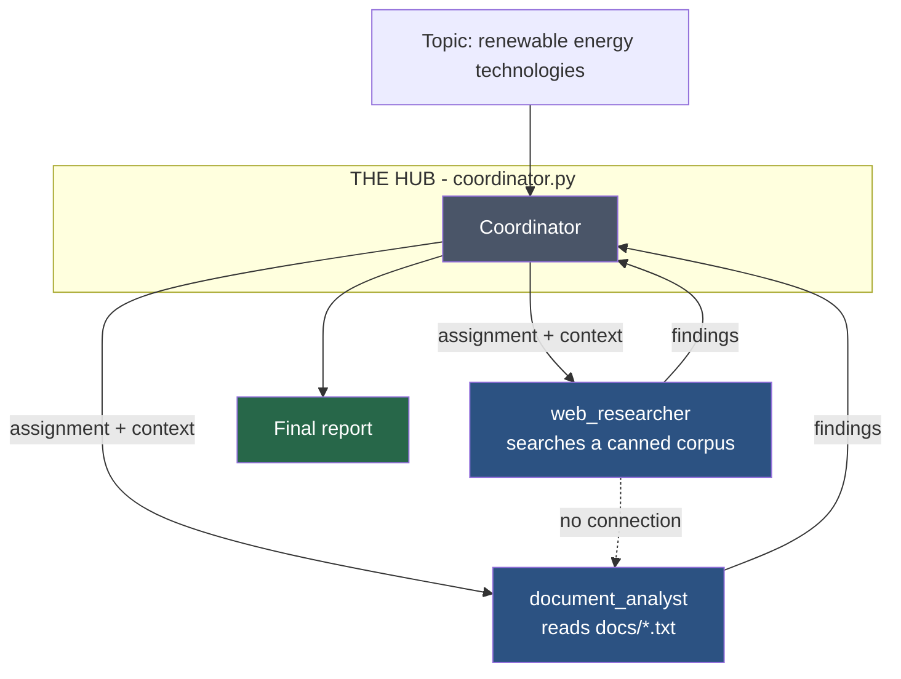
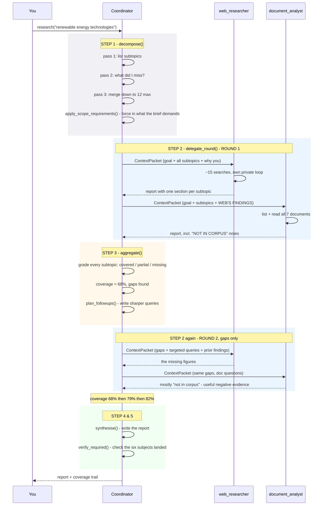
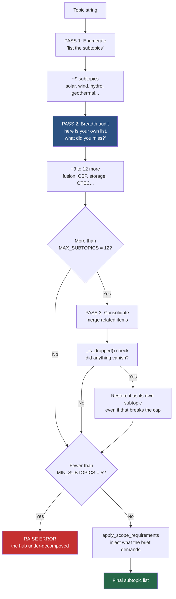
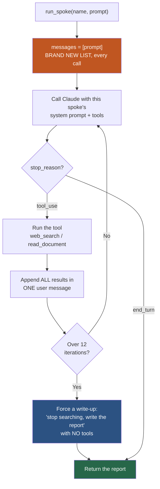
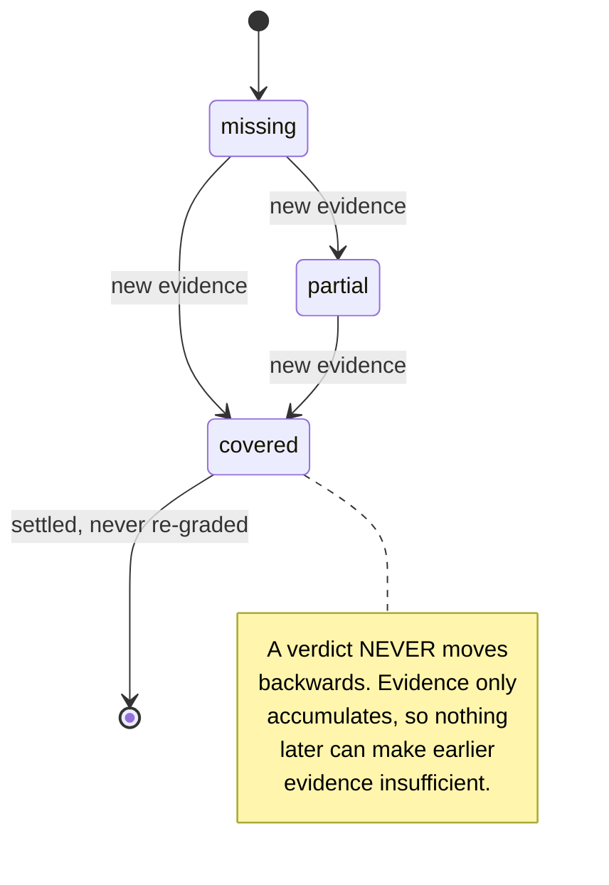
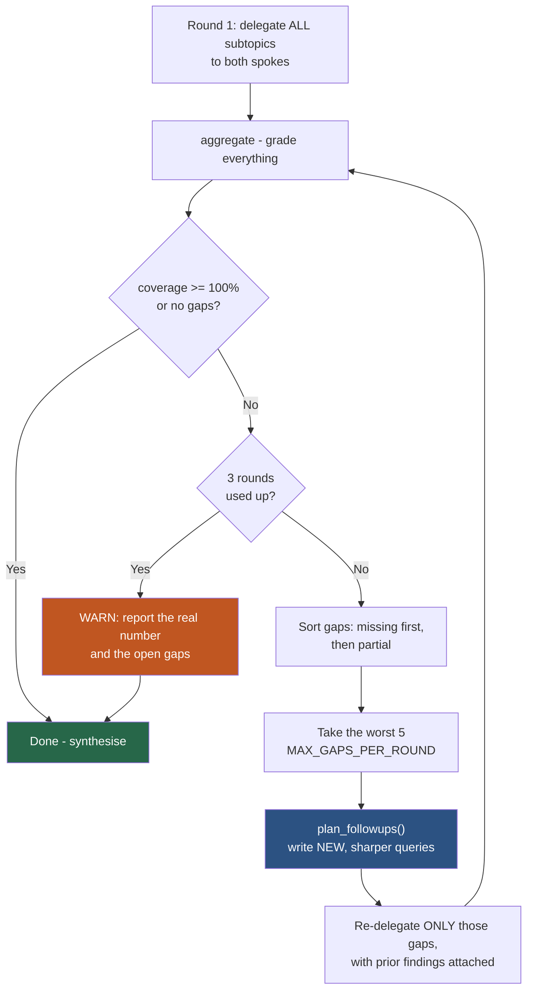
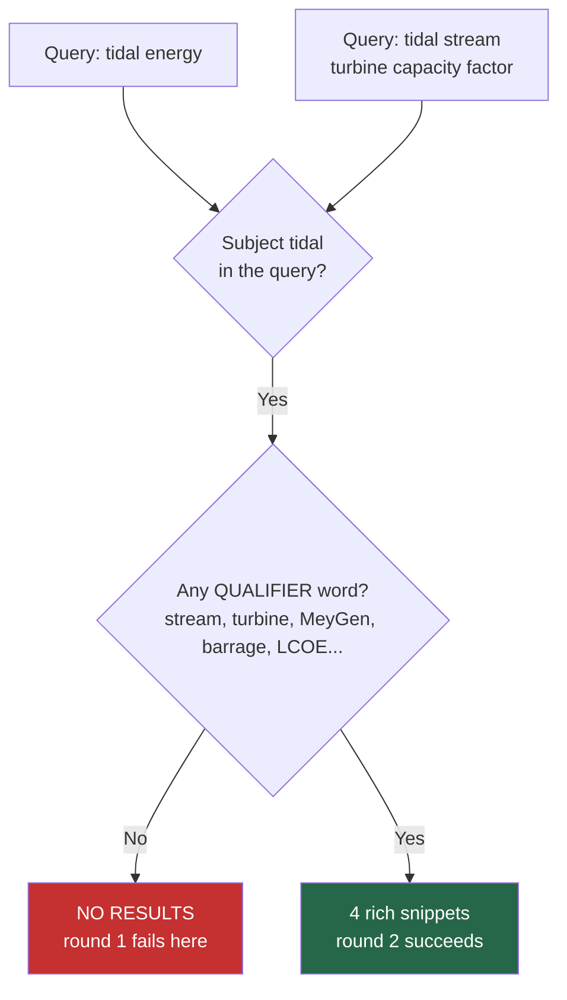
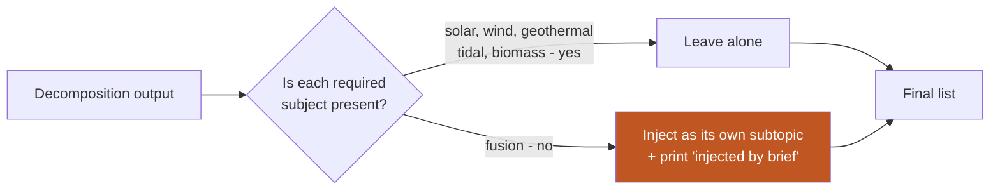

# How `coordinator.py` works

A plain-language walkthrough of the code. Read this alongside `coordinator.py`; the
`README.md` covers *why* the design is shaped this way, this file covers *what runs when*.

---

## 1. The one-sentence version

A **coordinator** splits a topic into subtopics, sends them to **two research subagents**,
grades what comes back, and keeps re-sending the weak parts until the report is good enough.



The dotted line is the important one: **the two spokes never talk to each other.** Every
arrow passes through the hub. That is what "hub-and-spoke" means.

---

## 2. The whole run, start to finish

This is what happens when you type `python3 coordinator.py`:



---

## 3. Step 1 — `decompose()`: turning a topic into subtopics

This is the most important function in the file. If it gets the breadth wrong, **nothing
downstream can fix it** — no subagent is told to look for the missing category, and no
coverage check is ever scored against it.



**Why three passes?** Pass 1 alone reliably gives you the *famous* members of a category and
stops — solar, wind, maybe hydro. The model always knew geothermal existed; nothing had ever
asked it to check its own list for holes. Pass 2 asks. That is the entire fix for the
"narrow decomposition" failure.

**Why is `_is_dropped()` written in code, not asked for in a prompt?** Because a merge that
quietly deletes a category looks identical, three steps later, to never having thought of
it. Code can check it; a prompt can only request it. This guard fires in real runs.

---

## 4. Step 2 — `run_spoke()`: how one subagent runs

Each spoke is an independent agent loop. It gets a prompt, calls its tools until it is done,
and returns text.



Two things to notice:

**`messages` is created empty on every call** (the orange box). The spoke cannot see the
coordinator's history, the other spoke's history, or its own history from a previous round.
Whatever the hub forgot to put in the prompt *genuinely does not exist* for that spoke.

> This is the diagnostic the whole design is built around: **if a subagent returns thin
> work, read the prompt it was sent before blaming the subagent.**

**The write-up forcing** (blue box) exists because of a real bug. Originally a spoke that ran
out of iterations returned scraps. It had done the research and simply never written it
down — so the next coverage check read it as a gap it never addressed, and the hub
re-delegated work that was already finished. Coverage froze. One extra turn with no tools
fixed it.

### What each spoke can reach

| Spoke | Tools | Sees |
|---|---|---|
| `web_researcher` | `web_search` | A canned snippet corpus (no network) |
| `document_analyst` | `list_documents`, `read_document` | The 7 files in `docs/` |

They are deliberately different, so the hub has two genuinely different bodies of evidence
to combine rather than two paraphrases of one.

---

## 5. `ContextPacket`: the only channel into a spoke

Because a spoke starts blank, everything it knows arrives in one string. `ContextPacket` is
the dataclass that builds that string:

```mermaid
graph LR
    subgraph P [ContextPacket]
        A[research_goal<br/>the ORIGINAL topic]
        B[assignment<br/>which subtopics]
        C[why_assigned<br/>why YOU got this]
        D[prior_findings<br/>what the other spoke found]
        E[known_gaps<br/>what came back thin]
        F[targeted_queries<br/>sharper queries to try]
        G[round_number]
    end
    P -->|.render()| H[One prompt string]
    H --> I[run_spoke]

    style P fill:#4a5568,color:#fff
```

It is a dataclass with named fields rather than an f-string on purpose. If you drop the
research goal from a prompt, **nothing raises an error** — you just get a subagent
optimising for the wrong thing and a report you cannot explain. Named fields make the
omission visible where the packet is built.

`prior_findings` is why the spokes run **sequentially**: the document analyst runs second so
its packet can carry the web researcher's findings. The spokes have no channel between them,
so anything that crosses does so because the hub carried it.

---

## 6. Step 3 — `aggregate()`: grading the results

The hub scores every subtopic against the **combined** findings of both spokes:

| Grade | Means | Score |
|---|---|---|
| `covered` | Real figures, named projects, dates | 1.0 |
| `partial` | Mentioned, but no substance behind it | 0.5 |
| `missing` | Both spokes came back empty | 0.0 |

`coverage_score()` is just the weighted average. `COVERAGE_THRESHOLD = 1.0` means every
subtopic must reach `covered` to stop early.

### Coverage can only improve



This rule is load-bearing, not an optimisation. An LLM grader re-scoring the same growing
pile of evidence does not return the same verdict twice, so a subtopic judged `covered` in
round 1 comes back `partial` in round 2 on wording alone. The loop then chases a number that
moves in both directions and never converges — an earlier version of this code went
**75% → 60% while strictly gaining evidence.** Now settled subtopics are not re-graded at
all, and `_RANK` keeps every verdict from regressing.

---

## 7. Step 3b — the refinement loop

This is what makes the hub a *coordinator* rather than a dispatcher. A dispatcher delegates
once and concatenates. This one grades its own output and goes back for more.



Three details that matter:

- **`plan_followups()` writes *new* queries.** Re-sending the same assignment returns the
  same empty result. The queries have to name specific technologies, projects or metrics.
- **Only 5 gaps per round.** Re-delegating every shortfall at once just rebuilds the round-1
  prompt that already failed, and the packets grow until the spoke runs out of iterations.
- **Hitting the round limit is reported honestly**, not papered over.

---

## 8. The seeded gap — why the loop has real work to do

Both data sources are rigged so round 1 genuinely comes back incomplete on **tidal** and
**fusion**:



In `_CORPUS`, entries are keyed `(subject, qualifiers)`. Most subjects have **no**
qualifiers, so `"solar power"` matches immediately. Tidal and fusion **do** have them, so a
broad category-name query misses and only a targeted follow-up gets through.

On the document side, `docs/05-marine-energy-placeholder.txt` is an empty placeholder memo
and `docs/06-frontier-technologies.txt` lists fusion as tracking-only. So the document
analyst honestly reports "NOT IN CORPUS" and the web spoke has to supply it — which is the
two spokes being genuinely complementary rather than redundant.

---

## 9. Steps 4 & 5 — writing and checking the report

- **`synthesise()`** writes the final markdown: one section per subtopic, in order. It is
  also handed the coverage verdicts, so a thin section *says* it is thin instead of being
  padded out.
- **`verify_required()`** then re-reads the finished report and checks each subject the brief
  demanded actually landed — counting mentions and looking for its own heading.

That last check is deliberately independent of `aggregate()`. The grader scores the findings
the spokes *returned*; this scores what actually reached *the page*. They come apart in the
one direction that matters — evidence gathered but never written up — and only reading the
report catches it.

---

## 10. `must_cover`: when the brief overrides the taxonomy

Fusion is **not** a renewable technology (its fuel is mined lithium and deuterium), so a
correct decomposition omits it about half the time. Arguing taxonomy in a prompt does not
reliably change that.



`--must-cover` lets the brief assert scope directly. Anything injected is **announced** in
the output, so the report's breadth is never mistaken for something the decomposition found
on its own. Run `--no-brief` to see the unaided version.

---

## 11. Function map

Read them in this order:

| # | Function | Line | Job |
|---|---|---|---|
| 1 | `research()` | ~1337 | The main loop. Start here. |
| 2 | `decompose()` | ~777 | Topic → subtopics, in three passes |
| 3 | `apply_scope_requirements()` | ~733 | Force in what the brief demands |
| 4 | `ContextPacket.render()` | ~639 | Builds the one string a spoke receives |
| 5 | `delegate_round()` | ~1208 | Runs both spokes, in order |
| 6 | `run_spoke()` | ~466 | One isolated subagent loop |
| 7 | `aggregate()` | ~1053 | Grades coverage, monotonically |
| 8 | `plan_followups()` | ~1170 | Turns gaps into sharper queries |
| 9 | `synthesise()` | ~1265 | Writes the report |
| 10 | `verify_required()` | ~1311 | Checks the report against the brief |

Helpers: `structured_call()` forces a reply through a tool schema so you get a validated
dict instead of prose to regex; `dispatch()` runs a spoke tool and turns any exception into
an error *result* rather than killing the loop; `digest()` bounds how much prior-agent text
gets forwarded.

---

## 12. The dials

| Constant | Value | What it does |
|---|---|---|
| `MODEL` | `claude-haiku-4-5` | Cheapest model; $1/$5 per M tokens |
| `MIN_SUBTOPICS` | 5 | Floor — below this the hub raises rather than proceed |
| `MAX_SUBTOPICS` | 12 | Soft ceiling — yields to breadth if a merge drops something |
| `COVERAGE_THRESHOLD` | 1.0 | Stop early only at 100% |
| `MAX_REFINEMENT_ROUNDS` | 3 | Cost backstop on the outer loop |
| `MAX_GAPS_PER_ROUND` | 5 | Gaps chased per round, worst first |
| `MAX_SPOKE_ITERATIONS` | 12 | Tool-loop cap inside one spoke |
| `DIGEST_LIMIT` | 2600 | Chars of prior findings forwarded onward |

**Cost:** one full run is roughly 25–30 API calls — 2 spokes × 3 rounds, plus decomposition
(3), grading (3), follow-up planning (2) and synthesis (1). Well under a cent on Haiku. The
search stub makes no network calls.

---

## 13. Reading a run's output

```
[1] decomposition
  pass 1 -> 10: Solar photovoltaic, Solar thermal, Wind energy, ...
  pass 2 (breadth audit) -> +5: Nuclear fusion, Concentrated solar power, ...
  consolidated -> 12: ...
  restored dropped -> Emerging and alternative sources     <- the lossless guard firing
  scope check: 5/6 required subjects already present
  injected by brief -> fusion                              <- honest about what was forced

[2.1] initial delegation
    -> web_researcher (2946 chars of explicit context)     <- size of the packet

[3.1] aggregation and coverage evaluation
  [x] Solar photovoltaic systems    covered   Global weighted-average LCOE $0.043/kWh...
  [ ] Wave and ocean energy         missing   Document analyst reports explicit deferral...
  coverage: 68%
  5 gap(s) this round: ...                                 <- what gets re-delegated

[5] brief verification
  [x] fusion         own section
  required-subject coverage: 6/6
```

**If a report comes back thin, read it top-down.** The decomposition is printed first for
exactly this reason: you can see immediately whether the hub never named the missing subject
(a decomposition bug) or named it and got nothing back (a source or prompt problem). That
diagnostic order — hub first, spokes second — is the whole point of the architecture.
